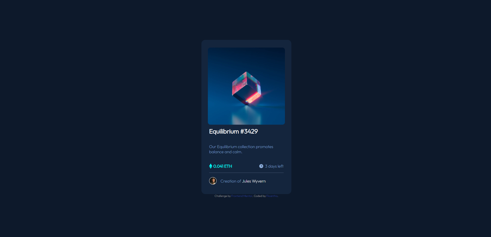

# Frontend Mentor - NFT preview card component solution

This is a solution to the [NFT preview card component challenge on Frontend Mentor](https://www.frontendmentor.io/challenges/nft-preview-card-component-SbdUL_w0U). Frontend Mentor challenges help you improve your coding skills by building realistic projects. 

## Table of contents

- [Overview](#overview)
  - [Screenshot](#screenshot)
- [My process](#my-process)
  - [Built with](#built-with)
  - [What I learned](#what-i-learned)
  - [Useful resources](#useful-resources)
- [Author](#author)

## Overview

### Screenshot



## My process

### Built with

- Semantic HTML5 markup
- CSS custom properties
- Flexbox

### What I learned

I learn how to modify apparence of image with active and put color over it.

```html
<div id="img">
      <a href="#">
        
      </a>
    </div>
```
```css
#img
{
    border-radius: 10px;
    height: 300px;
}
#img:active
{
    background:hsl(178, 100%, 50%);
    background-image: url('/images/icon-view.svg');
    background-repeat: no-repeat;
    background-position: center;
}
#img:active img{
    opacity: 0.5;
}
img::after:active{
    background-color: aqua;
}
img{
    width: 300px;
    border-radius: 10px;
}
```

### Useful resources

- [W3School](https://www.w3schools.com/) - This helped me for every question a have and for see reference of html/css
- [MDN Web Docs](https://developer.mozilla.org/) - This helped me for every question a have and for see reference of html/css 

## Author

- Floantho - [@Floantho](https://www.frontendmentor.io/profile/Floantho)
